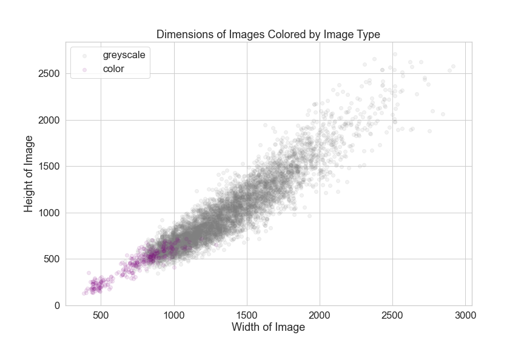

# Identifying Pneumonia Using Deep Learning

**Authors**: [Yung Han Jeong](mailto:), [Dan Valenzuela](mailto:dan@danvalenzuela.com)

## Overview
This project aims to develop a deep learning model to accurately identify cases of pneumonia using x-ray images of patients' lungs. Doctors both overdiagnose and underdiagnose pneumonia, both of which can have fatal consequences. Using a neural net with one input layer, one ReLU-activated hidden layer, and one sigmoid-activated output layer, all densely connected, this project was able to achieve an F1 score of 0.873. Given this F1 score, we believe this model can be best used in instances where doctors are unsure of the diagnosis and may want to use computer methods to identify pneumonia patterns invisible to human perception.

## Problem
Doctors both overdiagnose and underdiagnose pneumonia, both of which have can have fatal consequences. 1 A failure to diagnose pneumonia (and generally underdiagnosing in a population) can lead to potentially fatal complications as the illness develops. This project aims to contribute to current efforts in developing machine learning-assisted pneumonia diagnoses by creating a deep-learning model that classifies chest x-ray images as having pneumonia or not having pneumonia.  


## Data

The data used is a [Kaggle](https://www.kaggle.com/paultimothymooney/chest-xray-pneumonia) data set been split into test, train, and validation subsets. Below is an overview of the images' height and width categorized by whether they belong to one of the test-train subsets. 


Further, each of the images come in varying sizes and color. Generally speaking the images are about 1.5 times wider than they are high.



## Methodology

The deep learning model presented here went through three iterations implemented through Pytorch. The basic model contains one input layer, one hidden layer, and one output layer, all densely connected. Before the images are fed into the model, they are resized, converted to greyscale where needed, and normalized.

## Results

This model achieves an F1 score of 0.873 and a recall of 0.910 on a testing data set of about 625 images. Considering that deep learning models generally tend to overfit to the data, achieving a recall score of less than 1 shows that the regularization and the threshold setting helps with the overfitting.


## Conclusion

There are three possible impacts we can foresee for this model:

1. Doctors

In cases where doctors can see evidence of both pneumonia and non-pneumonia, this model can be utilized as a supplemental tool to provide additional insight.

2. Labs and Specialists


The tool can help labs and specialists performing x-ray imaging with their own x-ray analysis.

3. Patients

Such a model may assist in providing positive outcomes for patietns in a quick and cost-effective manner.
However, the model can still be improved throught the following proposed next steps:

1. Class Imbalance

Since our training dataset has a higher prevalance of pneumonia than the general population, the training can be assisted throguh upsampling of the minority class in the data.

2. Less Compression

We can increase the amount of information the model can use by increasing the amount of processing power available to the model, and hopefully increase performance.

3. Complexity

We can introduce additional layers to the model and reduce the amount of processing done to the images.

## Repository Structure

```
├── README.md                           <- The top-level README for reviewers of this project
├── Project_Walkthrough.ipynb           <- Narrative documentation of analysis in Jupyter notebook
├── Pneumonia-ID.pdf                    <- PDF version of project presentation
├── src                                 <- Contains python modules
│   └── modules                         <- .py files
├── images                              <- Both sourced externally and generated from 
│                                          code
├── notebooks                           <- Noteboooks used to build Walkthrough
├── models                              <- Saved models
└── data                                <- Data obtained from the Census Bureau
    └── extracted                       <- .py files

```